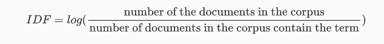
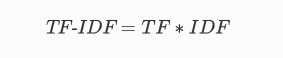

# eye-of-emergency

## Veille

#### 5. En plus de la ponctuation, on retrouve souvent des caractères spéciaux au sein de données textuelles. Comment sont traités ces deux types de caractères ?

Généralement en NLP on va etre amené à supprimer les ponctuations et les caractères spéciaux. S'agissant de caractères sans aucune valeur ajouter ils viennent polluer notre donnée et rendent les taches de NLP plus compliquées.

#### 6. Qu’est ce qu’un token ? un N-gram ? Quel processus permet-il de les obtenir ?

<u>Token</u>

La tokenization est une tache primordiale lors du NLP. Il s'agit d'une façon de séparer les mots d'une phrase en leur attribuant un *token*. Ce token peut prendre plusieurs formes différentes en fonction de la méthode choisie mais globalement le but étant que chaque mot possède un id permettant aux différents modèle d'avoir un apprentissage plus optimisé. Les machines ne comprenant pas les mots comme les humains il est primordial d'effectuer cette étape lors du NLP.

Différents types de tokenization:

* Word tokenization; c'est une méthode qui casse un texte en mots
* Character tokenization; ici nous allons segmenté le texte en caractères individuels
* Subword tokenization; cette méthode combine les deux méthodes précédentes et va donc casser un texte en plusieurs chaines de caractères qui sont plus grandes que 1 mais qui ne font pas la taille d'un mot (ex. chatbot devient 'chat' & 'bot')

<u>N-gram</u>

Un N-gram constitue en NLP des séquences de n mots extrait d'un texte pour le processing du langage et son analyse. Cet N-gram peut etre aussi court q'un mot (unigram) et aussi long que plusieurs mots (bigram, trigram, etc.). Ces n-gram permettent de capturer le contexte entre plusieurs mots dans un texte.

Le N-gram est important en NLP car il permet de nuancer la compréhension du texte à l'aide du contexte permettant un processing de langage plus précis. 

Quelques bénéfices du N-gram:

* Modeling de langage; les N-gram aide à la capture de la probabilité de distribution de mots dans un langage donné
* Récupération d'information; ils peuvent aussi etre utilisé afin d'indexer et parcourir un texte dans le but d'obtenir des résultats plus pertinents
* Prédiction de texte; en analysant les N-gram les plus fréquent on pourra prédire le prochain mot dans une séquence de texte

Ces deux taches sont généralement effectuées lors du traitement de la donnée, avant d'utiliser un algorithme. 

On va dans un premier temps utiliser une librairie comme NLTK ou encore spaCy afin de nettoyer notre texte. Par la suite on va utiliser un script qui nous permet de générer les différents tokens.

#### 7. Expliquez les deux notions de Stemming et de Lemmatization. Quelle est la différence entre les deux ? Dans quels cas faut-il utiliser l’un plutôt que l’autre ?

<u>Stemming</u>

Le *Stemming* est une méthode de normalization de texte qui permet de convertir de la donnée brute en format lisible.

Ici on va supprimer les suffixes de nos mots en comparant nos tokens avec un lexique de de suffixes communs. L'algorithme le plus utilisé pour le stemming et *l'algorithme de Stemming de Porter* (Snowball Stemmer).

<u>Lemmatization</u>

La *Lemmatization* a le meme but que le stemming mais avec un fonctionnement différent. 

Contrairement au Stemming ici on va supprimer les affixes et non les suffixes. Le but étant de réduire les variations de mots en la forme principale utilisé dans le dictionnaire.

<u>Stemming vs Lemmatization</u>

Là ou le stemming va simplement supprimer les affixes en se basant sur un lexique prédéfini la Lemmatization va nettoyer chaque mot dans le but de normaliser la forme de chaque mot. 

La Lemmatization demande plus de temps que le Stemming en matière de traitement. Généralement nous allons utiliser le Stemming lors d'une analyse de sentiment par exemple alors que la Lemmatization elle va etre utilisée lors de la construction d'un chatbot par exemple. 

#### 8. En représentant les mots sous forme de vecteurs numériques, vous permettez à un algorithme de Machine Learning de traiter les données textuelles et d'en extraire des informations utiles. Étudiez les deux méthodes Bag of Words et TF-IDF.

<u>Bag of words</u>

Le modèle *Bag of words* et une méthode d'extraction qui permet de récupérer des features à partir d'un texte dans le but de l'utiliser lors d'un modeling en machine learning. 

Il s'agit d'une approche relativement simple et flexible qui peut etre utilisée de plusieurs manières différentes. 

Cette méthode comprends 2 choses:

* un vocabulaire de mots communs
* une mesure de présence de ces mots

Etapes : 

* Récupérer la donnée
* Définir le vocabulaire
* Création de vecteurs

Si le vocabulaire de comprend pas beaucoup de mots on peut utiliser des vecteurs avec une longueur fixe. Cependant, si la taille du vocabulaire augmente la taille des vecteurs augmentera également.

Le but étant donc d'optimiser notre vocabulaire afin de ne pas avoir une liste de mot trop grande qui compliquerai nos vecteurs. Pour ce faire nous pouvons suivre les étapes de traitement de la donnée tels que : 

* ignorer les majuscules
* ignorer la ponctuation
* ignorer les mots fréquents sans conséquence pour la compréhension du texte 
* correction des erreurs d'orthographe
* réduire les mots à leur racine (ex. playing -> play)

Sinon, une autre méthode consiste en la création d'un vocabulaire de mots groupés.

Une fois le vocabulaire défini nous allons attributer un score à nos mots ce qui nous permet d'avoir une idée de la présence des mots dans le texte ainsi que leur récurrence.

En termes de limitation il y en a quelques unes tels que: 

* Vocabulaire; comme nous l'avons vu la notion de vocabulaire peut etre limité s'il n'est pas traité correctement
* Parcimonie;  une représentation parcimonieuse est plus difficile à modéliser
* Sens; lorsqu'on ignore le contexte et l'ordre des mots le texte peut avoir moins de sens

<u>TF-IDF</u>

Il s'agit d'une méthode statistique en NLP qui mesure l'importance d'un terme dans un texte.

Les mots d'un texte sont donc transformés en nombre basé sur leur importance dans le but de vectoriser ce texte. 

Pour ce faire on va calculer *TF* qui correspond au *Term Frequency*. Ce calcul s'effectue en divisant le nombre de fois qu'un mot apparait dans le texte par le nombre total de mots dans le texte.

</img>

L'*IDF* quant à lui correspond à *l'inverse document frequency*. L'IDF représente la proportion de documents qui contienne un mot. Ici les mots qui sont le moins présent (par exemple des mots techniques) vont avoir une plus grande importance que les mots communs. 

</img>

Ensuite on va calculer le *TF-IDF* en multipliant ces deux valeurs.

</img>

Plus simplement, l'importance d'un mot est plus importante lors qu'il est très présent dans un texte et moins dans les autres. Cela nous permet d'avoir un niveau d'importance global pour un mot dans plusieurs textes. 