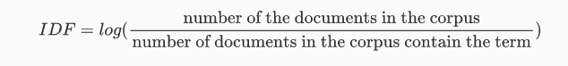
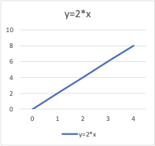
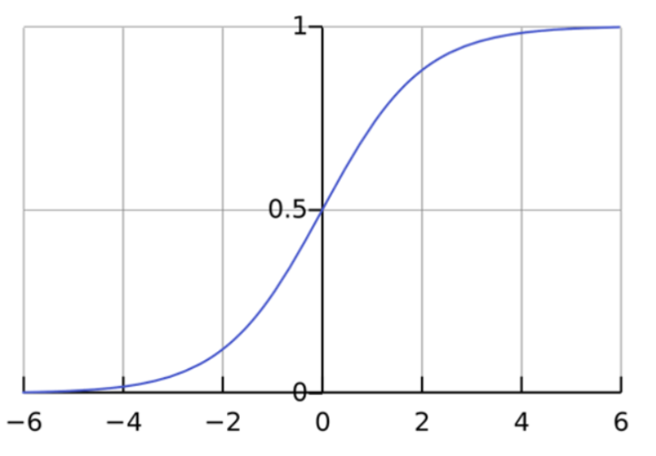
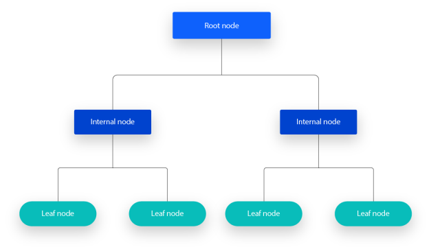
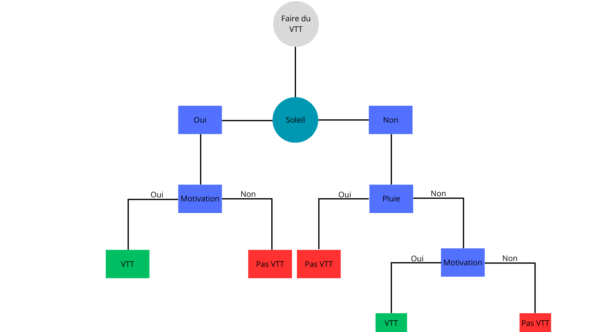

# <u>Eye of Emergency</u>

___

# I. Veille

## 1. Text Mining & Natural Language Processing
### **Text Mining**
_Définition_:  
Le Text Mining est un ensemble de méthodes informatiques et dotées d’intelligence artificielle qui consiste à extraire des connaissances et informations à partir d’ensembles volumineux de données textuelles non structurées ou semi-structurées.  
Il s'agit d'un processus qui va transformer de grandes quantités de contenus exprimés en langage naturel en des éléments exploitables et compréhensibles par une machine pour qu'en suite, la machine transforme ces éléments en informations exploitables par l'humain. Le Text Mining découle directement du Data Mining et se concentre sur l'utilisation de données textuelles de manière à mieux comprendre des tendances pour les prédire et les utiliser de manière stratégique.  

_La data pour le Text Mining_:  
Afin de faire du Text Mining, il faut travailler avec plusieurs formats de données.  

**Les données Non Structurées:**  
Les données non structurées correspondent a des data brutes, stockées dans leur état d’origine et qui n’ont pas été classifiées ni formatées en vue d’un traitement.  

**Les données Structurées:**  
Ce sont des data qui sont présentées dans un format que les machines peuvent comprendre, analyser et stocker. Les données sont donc contrôlées par des référentiels et classifiées selon des champs qui permettent de les interpréter et les traiter.  

**Les données Semi-Structurées:**  
Ces data n'ont pas été organisées selon des référentiels spécifiques mais elles présentent tout de même des éléments permettant de les traiter plus facilement que des données brutes non structurées. Elles ne sont pas compréhensibles par les machines mais elles présentent une certaine forme d'organisation qui va permettre de les examiner et de les utiliser.  

<u>Source</u>: https://www.qualtrics.com/fr/gestion-de-l-experience/client/text-mining/ 

### **Natural Language Processing (NLP)**:  
_Définition_:  
Le Natural Langage Processing (NLP) est un domaine du machine learning qui permet, via des algorithmes linguistiques et statistiques, de comprendre le langage naturel humain.

Concrètement, cette discipline est liée à l’intelligence artificielle et a pour objectif d’extraire le sens d’un écrit ou d’une discussion afin qu’il soit compris par une machine comme le comprendrait un cerveau humain.  

_Pourquoi le NLP ?_:  
Une grande majorité des données clients sont des données textuelles non structurées. Une énorme quantité de ces données sont est générée chaque jour et pour un humain, il est impossible de lire et retranscrire toutes ces données à des fins d'analyse. C'est là qu'intervient le NLP. En automatisant la lecture de texte grâce a des algorithmes qui vont identifier des mots et les grammaire utilisés par les clients pour trouver le sens principal d’un texte ou d’une conversation. C'est pour ces raisons que l'on retrouve aujourd'hui beacuoup de domaines d'pplications pour le NLP.  

_Domaines d'application_:  
- **Sentiment Analysis** -> Identifier l'opinion et le ressenti d'un individu.
- **Ciblage Marketing** -> Identifier les acheteurs potentiels et proposer la meilleure offre et/ou message.  
- **Analyse de marché** -> Dresser un portrait complet du marché existant et de la clientèle.  
- **Chatbots** -> répondre correctement aux questions simples des individus.  

<u>Source</u>: https://www.qualtrics.com/fr/gestion-de-l-experience/client/nlp/

### **Points communs**:  
- **Domaines d'application**: Les deux sont utilisés pour extraire des informations à partir de textes.  
- **Techniques partagées**: Les deux utilisent l'analyse de texte, y compris le nettoyage des données textuelles, la tokenisation, le stemming et la lemmatisation. Mais aussi les techniques d'apprentissage automatique telles que les algorithmes de classification, de clustering et de régression.  
- **Outils et Technologies**: Les deux utilisent des bibliothèques et outils similaires comme NLTK, spaCy, Gensim...  

### **Différences**:  
- **Objectifs**: Le Text Mining se concentre sur l'extraction de connaissances et d'information significatives à partir de texte là où le NLP se concentre sur la compréhension et la génération de langage naturel par les machines.  
- **Approches et Méthodologies**: Le TM utilise souvent des techniques statistiques et des méthodes de Data Mining pour analyser les textes et extraire des informations. Le NLP lui, implique des techniques linguistiques et informatiques plus complèxes pour permettre aux machines de comprendre et générer du langage humain.  
- **Complexité et Problèmes Traitables**: Le TM se concentre souvent sur des tâches moins complèxes comme l'extraction d'informations et l'analyse de sentiment alors que le NLP va être utilisé pour la compréhension contextuelle, l'ambiguïté linguistique et la génération de langage naturel cohérent.  

## 2. Les sous-domaines du NLP  
Le traitement automatique du langage naturel (NLP) englobe un large éventail de sous-domaines et de techniques, chacun ayant des objectifs spécifiques et des applications pratiques. Voici une liste des principaux sous-domaines et techniques du NLP:  
- Analyse de Sentiments (Sentiment Analysis)
- Reconnaissance d'Entités Nommées (Named Entity Recognition - NER)
- Étiquetage des Parties du Discours (Part-of-Speech Tagging - POS Tagging)
- Analyse Syntaxique (Parsing)
- Résolution de la Coréférence (Coreference Resolution)
- Extraction d'Information (Information Extraction)
- Traduction Automatique (Machine Translation)
- Résumé Automatique (Text Summarization)
- Question-Réponse (Question Answering)
- Reconnaissance Vocale (Speech Recognition)
- Génération Automatique de Texte (Text Generation)
- Modèles de Langage (Language Modeling)
- Analyse Sémantique (Semantic Analysis)
- Reconnaissance d'Intention (Intent Recognition)
- Classification de Texte (Text Classification)
- Clustering de Texte (Text Clustering)
- Analyse de Cohérence Textuelle (Textual Coherence Analysis)
- Correction Automatique de Texte (Text Correction)  

Pour cette veille nous allons nous concentrer sur seulement cinq de ces sous-domaines. A savoir, _L'Analyse de Sentiment_, _Le NER_, _le POS Tagging_, _Le Parsing_, _La Traduction Automatique_.  

### **<u>Analyse de sentiment</u>**:  
L'analyse de sentiments vise à déterminer l'attitude ou l'émotion exprimée dans un texte. Cette technique peut identifier des sentiments positifs, négatifs ou neutres dans des textes comme des avis de clients, des tweets, ou des articles de presse.  
_Exemple_: Imaginons un système d'analyse de sentiments appliqué aux avis de produits sur un site de commerce.  
- **Avis**: "J'adore ce produit! La qualité est excellente et le service client est exceptionnel."  
- **Résultat**: Sentiment positif (Score étant un chiffre entre 0 et 1).  
### **<u>Named Entity Recognition (NER)</u>**:  
Le NER consiste à identifier et classifier les entités nommées (personnes, organisations, lieux, dates, etc.) mentionnées dans un texte. Cette technique est cruciale pour extraire des informations spécifiques et structurées à partir de documents textuels.  
_Exemple_: Dans un article de presse, un système NER pourrait identifier et classer les entités suivantes: 
- **Texte**: "Apple a annoncé un nouveau produit lors de la conférence à San Francisco le 25 juin 2023."  
- **Résultat**: {Organisation: "Apple", Événement: "conférence", Lieu: "San Francisco", Date: "25 juin 2023"}
### **<u>POS Tagging</u>**:  
Le POS Tagging consiste à attribuer à chaque mot d'un texte son rôle grammatical, comme nom (noun), verbe (verb), adjectif (adjective), etc. Cette technique est fondamentale pour l'analyse syntaxique et la compréhension du texte.  
_Exemple_: Pour une phrase simple comme "Le chat dort sur le tapis," le POS Tagging produirait le résultat suivant: 
- **Phrase**: "Le chat dort sur le tapis" 
- **Résultat**: [("Le", "DET"), ("chat", "NOUN"), ("dort", "VERB"), ("sur", "PREP"), ("le", "DET"), ("tapis", "NOUN")]
### **<u>Analyse Syntaxique (Parsing)</u>**: 
L'analyse syntaxique consiste à déterminer la structure grammaticale d'une phrase. Cela permet de comprendre les relations entre les mots et les phrases. 
_Exemple_: Pour la phrase "Le chat mange une souris", l'analyse syntaxique pourrait générer un arbre syntaxique indiquant que "le chat" est le sujet, "mange" est le verbe et "une souris" est l'objet.
### **<u>Traduction Automatique</u>**: 
La traduction automatique est la tâche de traduire automatiquement du texte d'une langue à une autre. 
_Exemple_: Traduire "Bonjour, comment allez-vous?" de français en anglais donnerait "Hello, how are you?".  

## 3. Exemples d'application du NLP  
Les domaines d'application du NLP sont très larges, en voici une liste non exhaustive:  
- Assistants Virtuels & Chatbots -> comprendre et répondre aux demandes d'un utilisateur.
- Traduction Automatique -> traduire un texte d'une langue à une autre.
- Analyse de Sentiments pour les réseaux sociaux -> identifier des tendances positives ou négatives concernant un produit après analyse d'un large nombre de publications.
- Systèmes de recommandations -> analyse les commentaires, like et critiques afin de faire des suggestions. 
- Détection de Fraude -> analyse les communications et transactions suspectes.
- Reconnaissance vocale et Transcription -> permet de convertir la parole en texte.
- Résumé Automatique de Documents -> parcourt et condense de longs documents.  

## 4. Les Stop-Words
_Définition_:  
Les stop words sont les tokens très fréquents dans une langue donnée. Ces tokens étant présents dans la plupart des textes, ils ont un pouvoir discriminant assez faible. On a donc tendance à les supprimer pour réduire encore plus la taille du vocabulaire.  

<u>Source</u>: https://blog.octo.com/nettoyage-du-texte-en-nlp-moins-de-vocabulaire-moins-de-bruit  

Il est important de supprimer les Stop-Words pour plusieurs raisons.  
Tout d'abord afin de réduire la taille des données. En les supprimant la quantité de données à traiter est réduite ce qui accélère le traitement et diminue l'utilisation des ressources.  
En suite, supprimer les Stop-Words améliore la précision du modèle. En effet, les Stop-Words peuvent introduire du bruit dans les analyses textuelles, ce qui peut réduire la précision des modèles NLP. En les supprimant, on se concentre sur les mots porteurs de sens et pertinents, ce qui permet de mieux capturer les relations et les significations dans les textes.  
Pour finir cela permet d'améliorer la pertinence des termes utilisés pour ces analyses.  

_Exemple_:  
Considérons un texte simple:

"Le chat dort sur le tapis et il est très confortable."

<u>Texte Avant Suppression des Stop-Words</u>:
"Le chat dort sur le tapis et il est très confortable."

<u>Texte Après Suppression des Stop-Words</u>:
"chat dort tapis confortable"

Dans cet exemple, les mots "Le", "sur", "et", "il", "est", "très" ont été supprimés car ce sont des stop-words. Les mots restants, "chat", "dort", "tapis", et "confortable", portent une signification contextuelle importante et sont essentiels pour les tâches de NLP comme l'analyse de sentiments ou la classification de texte.

#### 5. En plus de la ponctuation, on retrouve souvent des caractères spéciaux au sein de données textuelles. Comment sont traités ces deux types de caractères ?

Généralement en NLP on va etre amené à supprimer les ponctuations et les caractères spéciaux. S'agissant de caractères sans aucune valeur ajouter ils viennent polluer notre donnée et rendent les taches de NLP plus compliquées.

#### 6. Qu’est ce qu’un token ? un N-gram ? Quel processus permet-il de les obtenir ?

<u>Token</u>

La tokenization est une tache primordiale lors du NLP. Il s'agit d'une façon de séparer les mots d'une phrase en leur attribuant un *token*. Ce token peut prendre plusieurs formes différentes en fonction de la méthode choisie mais globalement le but étant que chaque mot possède un id permettant aux différents modèle d'avoir un apprentissage plus optimisé. Les machines ne comprenant pas les mots comme les humains il est primordial d'effectuer cette étape lors du NLP.

Différents types de tokenization:

* Word tokenization; c'est une méthode qui casse un texte en mots
* Character tokenization; ici nous allons segmenté le texte en caractères individuels
* Subword tokenization; cette méthode combine les deux méthodes précédentes et va donc casser un texte en plusieurs chaines de caractères qui sont plus grandes que 1 mais qui ne font pas la taille d'un mot (ex. chatbot devient 'chat' & 'bot')

<u>N-gram</u>

Un N-gram constitue en NLP des séquences de n mots extrait d'un texte pour le processing du langage et son analyse. Cet N-gram peut etre aussi court q'un mot (unigram) et aussi long que plusieurs mots (bigram, trigram, etc.). Ces n-gram permettent de capturer le contexte entre plusieurs mots dans un texte.

Le N-gram est important en NLP car il permet de nuancer la compréhension du texte à l'aide du contexte permettant un processing de langage plus précis. 

Quelques bénéfices du N-gram:

* Modeling de langage; les N-gram aide à la capture de la probabilité de distribution de mots dans un langage donné
* Récupération d'information; ils peuvent aussi etre utilisé afin d'indexer et parcourir un texte dans le but d'obtenir des résultats plus pertinents
* Prédiction de texte; en analysant les N-gram les plus fréquent on pourra prédire le prochain mot dans une séquence de texte

Ces deux taches sont généralement effectuées lors du traitement de la donnée, avant d'utiliser un algorithme. 

On va dans un premier temps utiliser une librairie comme NLTK ou encore spaCy afin de nettoyer notre texte. Par la suite on va utiliser un script qui nous permet de générer les différents tokens.

#### 7. Expliquez les deux notions de Stemming et de Lemmatization. Quelle est la différence entre les deux ? Dans quels cas faut-il utiliser l’un plutôt que l’autre ?

<u>Stemming</u>

Le *Stemming* est une méthode de normalization de texte qui permet de convertir de la donnée brute en format lisible.

Ici on va supprimer les suffixes de nos mots en comparant nos tokens avec un lexique de de suffixes communs. L'algorithme le plus utilisé pour le stemming et *l'algorithme de Stemming de Porter* (Snowball Stemmer).

<u>Lemmatization</u>

La *Lemmatization* a le meme but que le stemming mais avec un fonctionnement différent. 

Contrairement au Stemming ici on va supprimer les affixes et non les suffixes. Le but étant de réduire les variations de mots en la forme principale utilisé dans le dictionnaire.

<u>Stemming vs Lemmatization</u>

Là ou le stemming va simplement supprimer les affixes en se basant sur un lexique prédéfini la Lemmatization va nettoyer chaque mot dans le but de normaliser la forme de chaque mot. 

La Lemmatization demande plus de temps que le Stemming en matière de traitement. Généralement nous allons utiliser le Stemming lors d'une analyse de sentiment par exemple alors que la Lemmatization elle va etre utilisée lors de la construction d'un chatbot par exemple. 

#### 8. En représentant les mots sous forme de vecteurs numériques, vous permettez à un algorithme de Machine Learning de traiter les données textuelles et d'en extraire des informations utiles. Étudiez les deux méthodes Bag of Words et TF-IDF.

<u>Bag of words</u>

Le modèle *Bag of words* et une méthode d'extraction qui permet de récupérer des features à partir d'un texte dans le but de l'utiliser lors d'un modeling en machine learning. 

Il s'agit d'une approche relativement simple et flexible qui peut etre utilisée de plusieurs manières différentes. 

Cette méthode comprends 2 choses:

* un vocabulaire de mots communs
* une mesure de présence de ces mots

Etapes : 

* Récupérer la donnée
* Définir le vocabulaire
* Création de vecteurs

Si le vocabulaire de comprend pas beaucoup de mots on peut utiliser des vecteurs avec une longueur fixe. Cependant, si la taille du vocabulaire augmente la taille des vecteurs augmentera également.

Le but étant donc d'optimiser notre vocabulaire afin de ne pas avoir une liste de mot trop grande qui compliquerai nos vecteurs. Pour ce faire nous pouvons suivre les étapes de traitement de la donnée tels que : 

* ignorer les majuscules
* ignorer la ponctuation
* ignorer les mots fréquents sans conséquence pour la compréhension du texte 
* correction des erreurs d'orthographe
* réduire les mots à leur racine (ex. playing -> play)

Sinon, une autre méthode consiste en la création d'un vocabulaire de mots groupés.

Une fois le vocabulaire défini nous allons attributer un score à nos mots ce qui nous permet d'avoir une idée de la présence des mots dans le texte ainsi que leur récurrence.

En termes de limitation il y en a quelques unes tels que: 

* Vocabulaire; comme nous l'avons vu la notion de vocabulaire peut etre limité s'il n'est pas traité correctement
* Parcimonie;  une représentation parcimonieuse est plus difficile à modéliser
* Sens; lorsqu'on ignore le contexte et l'ordre des mots le texte peut avoir moins de sens

<u>TF-IDF</u>

Il s'agit d'une méthode statistique en NLP qui mesure l'importance d'un terme dans un texte.

Les mots d'un texte sont donc transformés en nombre basé sur leur importance dans le but de vectoriser ce texte. 

Pour ce faire on va calculer *TF* qui correspond au *Term Frequency*. Ce calcul s'effectue en divisant le nombre de fois qu'un mot apparait dans le texte par le nombre total de mots dans le texte.

</img>

L'*IDF* quant à lui correspond à *l'inverse document frequency*. L'IDF représente la proportion de documents qui contienne un mot. Ici les mots qui sont le moins présent (par exemple des mots techniques) vont avoir une plus grande importance que les mots communs. 

</img>

Ensuite on va calculer le *TF-IDF* en multipliant ces deux valeurs.

</img>

Plus simplement, l'importance d'un mot est plus importante lors qu'il est très présent dans un texte et moins dans les autres. Cela nous permet d'avoir un niveau d'importance global pour un mot dans plusieurs textes. 

# II. Etude des cinq modèles d'apprentissage

#### 1. Régression Logistique
**Qu'est-ce que la régression logistique**  
La régression logistique est une technique d'analyse de données qui utilise les mathématiques pour trouver les relations entre deux facteurs de données. Elle utilise ensuite cette relation pour prédire la valeur de l'un de ces facteurs en fonction de l'autre. La prédiction a généralement un nombre fini de résultats, comme oui ou non.

Par exemple, supposons que vous souhaitez savoir si le visiteur de votre site web cliquera ou non sur le bouton de paiement dans son panier d'achat. La régression logistique examine le comportement des visiteurs précédents, tels que le temps passé sur le site web et le nombre d'articles dans le panier. En s'appuyant sur des données du passé, elle détermine que si les visiteurs ont passé plus de cinq minutes sur le site et ajouté plus de trois articles au panier, ils ont cliqué sur le bouton de paiement. À l'aide de ces informations, la fonction de régression logistique peut alors prédire le comportement d'un nouveau visiteur du site web.  

**Pourquoi la régression logistique est-elle importante ?**  
La régression logistique est une technique importante de l'intelligence artificielle et du Machine Learning. Les modèles de ML sont des programmes que l'on peut entraîner afin d'effectuer des tâches complèxes de traitement de données sans intervention humaine. Les modèles de ML crées avec la régression logistique aident par exemple des entreprises à obtenir des informations exploitables à partir de leurs données commerciales. Grâce à ces informations, elles peuvent réaliser une analyse prédictive afin de réduire les coûts opérationnels, d'augmenter l'efficacité et d'accélérer la mise à l'échelle. Voici une liste des avantages de l'utilisation de la régression logistique par rapport à d'autres techniques de ML:  

- Simplicité, les modèles de régression logistique sont mathématiquement moins complexes que les autres méthodes de machine learning. Par conséquent, vous pouvez les mettre en œuvre même si aucun membre de votre équipe ne possède d'expertise approfondie en machine learning.  

- Rapidité, les modèles de régression logistique peuvent traiter de grands volumes de données à grande vitesse, car ils nécessitent moins de capacité de calcul, comme la mémoire et la puissance de traitement. Cela fait d'eux une solution idéale pour les organisations qui se mettent au machine learning afin d'obtenir des résultats rapides.  

- Flexibilité, on peut utiliser la régression logistique pour trouver des réponses aux questions qui ont au moins deux résultats finis. On peut également l'utiliser pour prétraiter les données. Par exemple, la régression logistique peut permettre de trier les données ayant une large plage de valeurs, telles que les transactions bancaires, dans une plage de valeurs finie plus petite. On peut ensuite traiter ce plus petit jeu de données en utilisant d'autres techniques de machine learning pour une analyse plus précise.  

- Visibilité, l'analyse de régression logistique donne aux développeurs une meilleure visibilité sur les processus logiciels internes par rapport aux autres techniques d'analyse des données. Le dépannage et la correction des erreurs sont également plus faciles, car les calculs sont moins complexes.  

**Quelles sont les applications de la régression logistique ?**  
La régression logistique a plusieurs applications concrètes dans de nombreux secteurs d'activité différents comme par exemple la fabrication, les soins médicaux, la finance ou encore le marketing.  

**Comment fonctionne l'analyse de régression ?**  
La régression logistique est l'une des nombreuses techniques d'analyse de régression couramment utilisées par les spécialistes des données dans le domaine du machine learning. Pour comprendre la régression logistique, nous devons d'abord comprendre l'analyse de régression de base. Ci-dessous, j'explique comment fonctionne l'analyse de régression au moyen d'un exemple d'analyse de régression linéaire.

*Identifier la question*  
Toute analyse de données commence par une question commerciale. Pour la régression logistique, on doit formuler la question pour obtenir des résultats spécifiques, par exemple: 
- Les jours de pluie ont-ils un impact sur nos ventes mensuelles ? (oui ou non)  
- Quel type d'activité de carte de crédit le client effectue-t-il ? (activité autorisée, frauduleuse ou potentiellement frauduleuse)  

*Collecter les données historiques*  
Après avoir identifié la question, on doit identifier les facteurs de données impliqués. Nous collecterons ensuite les données passées pour tous les facteurs. Par exemple, pour répondre à la première question ci-dessus, nous pouvons collecter le nombre de jours de pluie et les données de ventes mensuelles pour les trois dernières années.  

*Entraîner le modèle d'analyse de régression*  
Nous allons traiter les données historiques à l'aide d'un logiciel de régression. le logiciel traitera les différents points de données et les reliera mathématiquement à l'aide d'équations. Par exemple, si le nombre de jours de pluie pendant trois mois est de 3, 5 et 8 et que le nombre de ventes pendant ces mois est de 8, 12 et 18, l'algorithme de régression reliera les facteurs à l'équation :  

Nombre de ventes = 2*(nombre de jours de pluie) + 2  

*Faire des prévisions pour des valeurs inconnues*  
Pour les valeurs inconnues, le logiciel utilise l'équation pour effectuer une prédiction. Si nous savons qu'il pleuvra pendant six jours en juillet, le logiciel estimera la valeur de vente de juillet à 14.  

**Comment fonctionne le modèle de régression logistique ?**  
*Equations*  
En mathématiques, les équations donnent la relation entre deux variables : x et y. On peut utiliser ces équations, ou fonctions, pour tracer un graphique le long de l'axe des x et de l'axe des y en saisissant différentes valeurs de x et y. Par exemple, si on trace le graphique pour la fonction y = 2*x, nous obtiendrons une ligne droite. Par conséquent, cette fonction est également appelée fonction linéaire.  
  

*Variables*  
En statistique, les variables sont les facteurs ou attributs de données dont les valeurs varient. Pour toute analyse, certaines variables sont des variables indépendantes ou explicatives. Ces attributs sont à l'origine d'un résultat. Les autres variables sont des variables dépendantes ou des variables de réponse, c'est-à-dire que leurs valeurs dépendent des variables indépendantes. En général, la régression logistique explore la façon dont les variables indépendantes affectent une variable dépendante en examinant les valeurs de données historiques des deux variables. 

Dans notre exemple ci-dessus, x est appelé variable indépendante, variable de prédiction ou variable explicative, car sa valeur est connue. Y est appelée variable dépendante, variable de résultat ou variable de réponse, car sa valeur est inconnue.  

*Fonction de régression logistique*  
La régression logistique est un modèle statistique qui utilise la fonction logistique, ou fonction logit, en mathématiques comme l'équation entre x et y. La fonction logit mappe y en tant que fonction sigmoïde de x.  
  

Si on trace cette équation de régression logistique, nous obtenons une courbe en S comme illustré ci-dessous.  
  

Comme on peut le constater, la fonction logit renvoie uniquement des valeurs comprises entre 0 et 1 pour la variable dépendante, quelles que soient les valeurs de la variable indépendante. C'est ainsi que la régression logistique estime la valeur de la variable dépendante. Les méthodes de régression logistique modélisent également des équations entre plusieurs variables indépendantes et une variable dépendante.  

*Analyse de régression logistique avec plusieurs variables indépendantes*  
Dans de nombreux cas, plusieurs variables explicatives affectent la valeur de la variable dépendante. Pour modéliser de tels jeux de données d'entrée, les formules de régression logistique supposent une relation linéaire entre les différentes variables indépendantes. Nous pouvons modifier la fonction sigmoïde et calculer la variable de sortie finale comme suit : 

y = f(β0 + β1x1 + β2x2+… βnxn)

Le symbole β représente le coefficient de régression. Le modèle logit peut effectuer un calcul inverse de ces valeurs de coefficient lorsqu'on lui donne un jeu de données expérimental suffisamment grand avec des valeurs connues de variables dépendantes et indépendantes.  

*Quels sont les types d'analyse de régression logistique ?*  
Il existe trois approches d'analyse de régression logistique basées sur les résultats de la variable dépendante.  

Régression logistique binaire  
La régression logistique binaire fonctionne bien pour les problèmes de classification binaire qui n'ont que deux résultats possibles. La variable dépendante ne peut avoir que deux valeurs, par exemple oui ou non ou 0 ou 1.

Même si la fonction logistique calcule une plage de valeurs comprise entre 0 et 1, le modèle de régression binaire arrondit la réponse aux valeurs les plus proches. En général, les réponses inférieures à 0,5 sont arrondies à 0, et les réponses supérieures à 0,5 sont arrondies à 1, de sorte que la fonction logistique renvoie un résultat binaire.

Régression logistique multinomiale
La régression multinomiale peut analyser des problèmes qui ont plusieurs issues possibles tant que le nombre de résultats est limité. Par exemple, elle peut prédire si les prix des maisons augmenteront de 25 %, 50 %, 75 % ou 100 % sur la base des données démographiques, mais elle ne peut pas prédire la valeur exacte d'une maison.

La régression logistique multinomiale fonctionne en mappant les valeurs de résultat à différentes valeurs comprises entre 0 et 1. Comme la fonction logistique peut renvoyer une plage de données continues, telles que 0,1, 0,11, 0,12, etc., la régression multinomiale regroupe également la sortie aux valeurs les plus proches possibles.

Régression logistique ordinale
La régression logistique ordinale, ou modèle logit ordonné, est un type spécial de régression multinomiale pour les problèmes dans lesquels les nombres représentent des rangs plutôt que des valeurs réelles. Par exemple, on utilisera la régression ordinale pour prédire la réponse à une question de sondage qui demande aux clients de classer un service comme mauvais, passable, bon ou excellent sur la base d'une valeur numérique, telle que le nombre d'articles qu'ils vous achètent au cours de l'année.

#### 2. Decision Tree
**Définition**  
Un arbre de décisions est un algorithme d'apprentissage supervisé non paramétrique, qui est utilisé à la fois pour les tâches de classification et régression. Il a une structure hiérarchique, une structure arborescente, qui se compose d'un noeud racine, de branches, de nœuds interne et de nœuds feuille.  

**Fonctionnement**  
Un arbre de décisions peut peut être représenté en trois parties distinctes:  
1. Le noeud racine
2. Les noeuds internes (ou noeuds de décision)
3. Les noeuds feuilles (ou noeuds terminaux)  

Un arbre de décisions commence donc par le noeud racine, tout en haut sur l'image et qui n'a pas de branches entrantes. Les branches sortant du noeud racine vont vers les noeuds de décisions. Puis, en fonction des caractéristiques disponibles, les deux types de noeuds effectuent des évaluation sur des sous-ensembles homogènes, à savoir les noeuds terminaux. Les noeuds terminaux sont donc tous les résultats possibles.  

*Exemple*  
Pour illustrer ceci nous avons réalisé un exemple simple d'arbre de décisions. 

L'apprentissage par arborescence de décisions utilise une stratégie de division et de conquête en effectuant une recherche gloutonne pour identifier les points de fractionnement optimaux au sein d'une arborescence. Ce processus de fractionnement est ensuite répété de manière descendante, récursive jusqu'à ce que tous, ou la majorité des enregistrements aient été classifiés sous des étiquettes de classe spécifiques.  

**Types de Decision Tree**  
L'algorithme de Hunt, qui a été développé dans les années 1960 pour devenir le modèle d'apprentissage humain en psychologie, forme la base de nombreux algorithmes d'arbre de décisions populaires, tels que les suivants : 

- ID3 : Ross Quinlan est crédité dans le développement d'ID3, qui est l'abréviation de « Iterative Dichotomiser 3 ». Cet algorithme exploite l'entropie et le gain d'informations comme mesures pour évaluer les fractionnements candidats. Certaines des recherche de Quinlan sur cet algorithme à partir de 1986 peuvent être trouvés  ici (PDF, 1,3 Mo) (le lien réside en dehors d' d' ibm.com).

- C4.5 : Cet algorithme est considéré comme une itération ultérieure d'ID3, également développée par Quinlan. Il peut utiliser des informations de gain ou de ratios de gain pour évaluer des points de fractionnement au sein des arbres de décisions. 

- CART : Le terme, CART, est une abréviation pour « arbres de classification et de régression » et a été introduit par Leo Breiman. Cet algorithme utilise typiquement l'impureté Gini pour identifier l'attribut idéal pour effectuer le fractionnement. L'impureté Gini mesure la fréquence à laquelle un attribut choisi au hasard est mal classé. Lors de l'évaluation à l'aide de l'impureté Gini, une valeur inférieure est plus idéale.  

**Avantages & Inconvénients**  
*Avantages:*  
- Facile à interpréter. La logique booléenne et les représentations visuelles des arbres de décisions les rendent plus faciles à comprendre et à consommer. Le nature hiérarchique d'un arbre de décisions permet également de voir facilement quels attributs sont les plus importants, ce qui n'est pas toujours clair avec d'autres algorithmes, similaires aux réseaux neuronaux.  

- Peu ou pas de préparation de données. Les arbres de décisions ont un nombre de caractéristiques, ce qui les rend plus flexibles que les autre classificateurs. Il peut traiter divers types de données, c'est-à-dire des valeurs discrètes ou continues, et les valeurs continues peuvent être converties en valeurs catégorielles grâce à l'utilisation de seuils. De plus, il peut également traiter des valeurs avec des valeurs manquantes, ce qui peut être problématique pour d'autres classificateurs, similaires à Naïve Bayes.  

- Plus flexible. Les arbres de décisions peuvent être exploités à la fois pour les tâches de classification et régression, ce qui les rend plus flexibles que certains autre algorithmes. Il est également insensible aux relations sous-jacentes entre les attributs ; cela signifie que si deux variables sont fortement corrélées, l'algorithme ne sélectionne qu'une seule des caractéristiques à fractionnement.  

*Inconvénients:*  
 - Sujet au surajustement. Les arbres décision complexes tendent à se surajuster et ne généralisent pas bien aux nouvelles données. Ce scénario peut être évité par les procédés de pré-élagage ou de post-élagage. Le pré-élagage arrête la croissance d'arbre lorsqu'il n'y a pas suffisamment de données tandis que le post-élagage supprime les sous-arbres avec des données inadéquates après la construction de l'arborescence. 

- Estimateurs à variance élevée. De petites variations dans les données peuvent produire un arbre de décisions très différent. Le bagging, ou la moyenne des estimations, peut être une méthode de réduction de la variance des arbres de décisions. Cependant, cette approche est limitée car elle peut aboutir à des prédicteurs hautement corrélés.  

- Plus coûteux. Étant donné que les arbres de décisions adoptent une approche de recherche gloutonne lors de la construction, ils peuvent être plus coûteux à entraîner par rapport à d'autres algorithmes. 

- Pas entièrement pris en charge dans scikit-learn. Scikit-learn est une bibliothèque d'apprentissage automatique populaire basée sur Python. Bien que cette bibliothèque ait un  module Arbre de décisions (DecisionTreeClassifier), l'implémentation en cours ne prend pas en charge les variables catégorielles.  

#### 3. Random Forest
**Définition**  
La forêt aléatoire est un algorithme d'apprentissage automatique couramment utilisé et qui permet d'assembler les sorties de plusieurs arbres de décision afin d'obtenir un résultat unique. Il permet de gérer à la fois les problèmes de classification et de régression de par la souplesse d'utilisation et la flexibilité qu'il offre.  

**Fonctionnement**  
Les Random Forest sont composés de plusieurs Decision Tree, que nous avons vu précedemment. Bien que les arbres de décision soient des algorithmes d'apprentissage supervisé courants, ils peuvent être sujets à des problèmes, tels que le biais et l'ajustement excessif. Cependant, lorsque plusieurs arbres de décision forment un ensemble dans l'algorithme de forêt aléatoire, ils prédisent des résultats précis, surtout lorsque les arbres individuels ne sont pas corrélés les uns aux autres.  

*Méthodes ensemblistes*  
Les méthodes ensemblistes des algorithmes d'apprentissage sont constituées d'un ensemble de classificateurs (par exemple, arbres de décision), et leurs prédictions sont agrégées pour identifier le résultat le plus fréquent. Les méthodes ensemblistes les plus connues sont le bagging, également appelé boostrap aggregation, et le boosting. Nous parlerons de ces deux méthodes plus tard.  

L'algorithme de forêt aléatoire est une extension de la méthode bagging, car elle repose sur le bagging et le feature randomness (fonction aléatoire) pour créer une forêt d'arbres de décision non corrélés. Le feature randomness, également appelé feature bagging génère un sous-ensemble aléatoire de fonctions, qui assure une faible corrélation entre les arbres de décision. Il s'agit là d'une différence essentielle entre les arbres de décision et les forêts aléatoires. Alors que les arbres de décision tiennent compte de toutes les subdivisions de fonctions possibles, les forêts aléatoires, elles, ne sélectionnent qu'un sous-ensemble de ces fonctions.  

Les algorithmes de Random Forest ont trois hyperparamètres principaux qui ne doivent pas forcément être définis avant l'entraînement, à savoir:  
- taille des noeuds
- nombre d'arbres
- nombre de fonctions échantillonnées

Le classificateur de Random Forest peut donc être utilisé pour résoudre des problèmes de régression ou de classification.  

L'algorithme est constitué d'un ensemble d'arbres de décision où chaque arbre de l'ensemble comprend un échantillon de données prit d'un ensemble d'entraînement avec remplacement appelé échantillon bootstrap. Un tiers de ces données est mis de côté comme données de test ou out-of-bag (oob). En suite, une autre instance aléatoire est injectée par le feature bagging ce qui va permettre d'ajouter plus de diversité dans le dataset et de diminuer la corrélation entre les arbres de décisions. Déterminer la prédiction dépend du type de problème:  
- pour de la régression les arbres individuels vont être moyennés
- pour de la classification un vote majoritaire est fait, donc la variable la plus fréquente par catégorie va prédire la classe. Pour finir, l"chantillon oob est utilisé pour effectuer une validation croisée afin de valider cette prédiction.  

#### Xgboost  

**Description**  
Xgboost, une implémentation avancée de l'algorithme de gradient boosting, est conçue pour offrir des performances élevées, une grande efficacité et une flexibilité remarquable. Développé par Tianqi Chen, Xgboost est réputé pour sa rapidité et sa capacité à traiter de grands ensembles de données. Il est couramment utilisé dans les compétitions de data science en raison de ses excellentes performances.  

**Fonctionnement**  
L'algorithme de Xgboost commence par prédire une valeur initiale pour toutes les instances de données, comme la moyenne des cibles dans une tâche de régression. Il construit ensuite des arbres de décision de manière séquentielle, chaque nouvel arbre étant entraîné sur les résidus (erreurs) des arbres précédents. Ce processus permet à chaque arbre de corriger les erreurs des arbres antérieurs. Pour éviter le sur-ajustement, Xgboost intègre des termes de régularisation (L1 et L2) qui pénalisent les modèles complexes. Les arbres de décision dans Xgboost accordent de l'importance aux caractéristiques qui réduisent le plus les erreurs, aidant à déterminer les caractéristiques les plus influentes. Les prédictions finales sont obtenues en combinant les prédictions de tous les arbres, généralement par une somme pondérée.  

**Avantages**  
- Performance: Xgboost est connu pour ses excellentes performances sur des ensembles de données complexes et de grande taille.
- Efficacité: L'algorithme est optimisé pour être rapide, grâce à des techniques telles que le parallélisme interne et l'utilisation efficace de la mémoire.
- Flexibilité: Il supporte différents types de tâches d'apprentissage supervisé, telles que la classification, la régression, et le ranking.
- Gestion des Données Manquantes: Xgboost traite les valeurs manquantes en apprenant la meilleure direction pour chaque point de bifurcation lors de la construction des arbres.  

**Inconvénients**  
- Complexité: Xgboost peut être difficile à paramétrer correctement, car il possède de nombreux hyperparamètres.
- Gourmand en Ressources: Il peut consommer beaucoup de mémoire et de temps de calcul, surtout pour les très grands ensembles de données.
- Interprétabilité: Comme beaucoup de modèles d'ensemble, Xgboost est moins interprétable que les modèles simples comme la régression logistique ou les arbres de décision uniques.  

#### Support Vector Machine (SVM)  
**Description**  
Le Support Vector Machine (SVM) est un modèle d'apprentissage supervisé principalement utilisé pour les tâches de classification. Développé par Vladimir Vapnik, le SVM est particulièrement efficace pour les problèmes où les classes sont linéairement séparables, mais il peut aussi être adapté pour des problèmes non linéaires en utilisant des noyaux. 

**Fonctionnement**  
Le SVM cherche à trouver l'hyperplan qui sépare le mieux les classes dans l'espace des caractéristiques, en maximisant la marge, c'est-à-dire la distance entre les points les plus proches de chaque classe (vecteurs de support) et l'hyperplan. Pour les problèmes non linéaires, le SVM utilise des fonctions noyau pour transformer les données dans un espace de plus haute dimension où les classes deviennent séparables par un hyperplan linéaire. Les noyaux couramment utilisés incluent les noyaux linéaire, polynomial, gaussien (RBF) et sigmoïde. Le SVM minimise une fonction de coût qui pénalise les erreurs de classification et les marges étroites, avec des techniques de régularisation pour trouver un équilibre entre la maximisation de la marge et la minimisation des erreurs de classification.  

**Avantages**  
- Efficacité sur les Petits Ensembles de Données: Le SVM est performant même avec des petits ensembles de données de haute dimension.
- Robustesse aux Dimensions: Efficace dans les espaces de haute dimension, ce qui le rend utile pour les problèmes de classification complexe.
- Flexibilité avec les Noyaux: La capacité d'utiliser différents noyaux permet au SVM de s'adapter à divers types de problèmes, qu'ils soient linéaires ou non linéaires.  

**Inconvénients**  
- Complexité de la Paramétrisation: Le choix du noyau et l'ajustement des hyperparamètres (comme le paramètre de régularisation et les paramètres du noyau) peuvent être délicats et nécessitent souvent une validation croisée exhaustive.
- Scalabilité: Les SVMs peuvent être lents et gourmands en mémoire pour les très grands ensembles de données, car la complexité de l'algorithme dépend du nombre d'échantillons.
- Interprétabilité: Les résultats des SVMs, surtout avec des noyaux non linéaires, peuvent être difficiles à interpréter en termes de caractéristiques d'entrée.